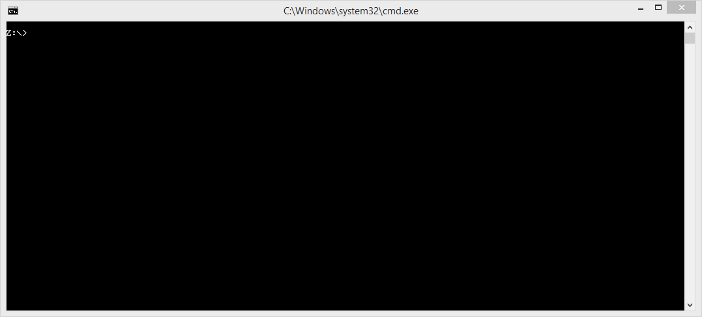

=================================
KiNOS interfacing tools (KiTools)
=================================

This project provides a Python wrapper for the `KiNOS <http://kinos.io/>`_
devices' interfaces: KSH, KBI, DFU and Sniffer.

The main purpose of the project is to help a novel KiNOS devices user understand
their capabilities and serve as a reference implementation for more advanced or
optimized developments.

This project is licensed under the terms of the MIT license.

There is a separate project for taking advantage of the USB Ethernet
capabilites of the KiNOS devices for the implementation of a Thread Border
Router: `KiBRA <https://github.com/KiraleTech/KiBRA>`_.

Features
========

- Lists connected KiNOS devices and some basic information.
- KSH serial terminal emulation with debug messages recognition.
- Python PPP Consistent Overhead Byte Stuffing (`COBS
  <https://tools.ietf.org/html/draft-ietf-pppext-cobs-00>`_) implementation for
  KBI UART communication.
- KSH to KBI translation: Kirale Binary Interface text to codes reference
  implementation.
- Python DFU implementation for firmware and patches flashing, with
  simultaneous devices flashing support.
- KBI firmware update protocol support (also capable of flashing several
  devices at the same time).
- Kirale Sniffer support: PCAP file generation or real time Wireshark capture
  view.
- Multiplatform: Windows, Linux and MacOS.
- Support for Python 2.7 and Python 3.x.

Requirements
============

The KiTools application is pure `Python <https://python.org>`_ software.
However, some system drivers and libraries are required.

Reference: `KiNOS USB drivers installation guide
<https://www.kirale.com/support/kb/install-usb-drivers/>`_

Windows
-------

For KSH, KBI and Sniffer support the program makes use of the `PySerial
<https://github.com/pyserial/pyserial/>`_ module and the ``USB Serial (CDC)``
driver is required in Windows.

The DFU functionality requires the use of `PyUSB
<https://github.com/pyusb/pyusb/>`_. It is required to install the ``libusbK``
driver for the *KiNOS DFU* devices with `Zadig <http://zadig.akeo.ie/>`_. The
build `libusb <http://libusb.info/>`_ DLL is provided here for Windows 32 bit
and Windows 64 bit and there is no need to install it on the system.

Linux
-----

Modern Linux kernel versions come with pre-built standard USB support. The
``cdc_acm module`` will be loaded by the system after a KiNOS device is
plugged in, which enables serial terminal communication.

In order to use the DFU flashing functionality, ``libusb-1.0`` is required,
and can be installled from the packages manager.

Installation
============

- Create the wheel and then install it.
::

 python setup.py sdist bdist_wheel
 python -m pip install --upgrade ./dist/kitools*.whl

- Or may do so directly if you wish
::

 python -m pip install --upgrade .

How to build a KiTools Windows executable
-----------------------------------------

- Install `Python 2.7 <https://www.python.org/>`_.
- Install pyinstaller
::

 python -m pip install pyinstaller

- Generate the spec file
::

 pyi-makespec.exe --onefile --icon ./images/logo.ico ./kitools/__main__.py -n KiTools

Assign this tuple to the binaries= argument of Analysis within spec file

``a = Analysis(...
         binaries=[ ( 'kitools/libusb/MS32/libusb-1.0.dll', '.' ) ],
         ...``

- Generate the executable
::

 pyinstaller ./KiTools.spec

Result file is ``dist/KiTools.exe``.

Pre-built executable
--------------------

A pre-built `KiTools <https://www.kirale.com/support/#downloads>`_ executable is provided here for Windows 32 bit systems
(also working in 64 bit systems).

Usage
=====
::

 $ python -m kitools --help
 usage: KiTools [-h] [--version] [--port PORT]
              [--channel {11,12,13,14,15,16,17,18,19,20,21,22,23,24,25,26}]
              [--live] [--file FILE] [--debug {0,1,2,3,4}]
              [--flashdfu FLASHDFU] [--flashkbi FLASHKBI]

 Serial interface to the KiNOS KBI, KSH, DFU and Sniffer

 optional arguments:
   -h, --help            show this help message and exit
   --version             show program's version number and exit
   --port PORT           serial device to use
   --channel {11,12,13,14,15,16,17,18,19,20,21,22,23,24,25,26}
                         sniffer channel (802.15.4)
   --live                launch a Wireshark live capture
   --file FILE           sniffer capture output file OR Wireshark path when
                         used with --live
   --debug {0,1,2,3,4}   show more program output
   --flashdfu FLASHDFU   provide a DFU file to flash all the connected Kirale
                         devices using DFU protocol
   --flashkbi FLASHKBI   provide a DFU file to flash all the connected Kirale
                         devices using KBI protocol

Screenshots
===========

KSH
---
Easy device selection with Kirale devices identification. Debug logs.

KBI
---
Translation of human-friendly commands to Kirale Binary Interface commands, and
further COBS encoding and decoding of the responses.

Sniffer
-------
A capture can be started directly from the device selection, by chosing a
Sniffer enabled device. The capture file will be saved in the same directory
by default.

It is also possible to directly launch the capture without further user prompt.

DFU flashing
------------
The application allows to flash all the connected devices at the same time.

KBI flashing
------------
The UART interface can be used as well for firmware updating, for example with
a USB to Serial adapter.

